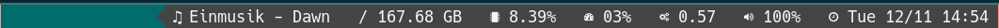

# lastfm-now

Show what a user is currently playing.

I created this to be displayed on my i3 status bar. Like this:



# Basic Usage

In order for this to work you will require a lastfm api key.  Grab one [here](https://www.last.fm/api/account/create)

## Install from pypi

`pip3 install lastfm-now`

## Install from source

```
cd lastfm-now-playing
pip3 install .
```

## Run

`lastfm-now` will read the api key from `LASTFM_API_KEY` environment variables. It can also be specified on the command line.

### Environment variables - example

```
export LASTFM_API_KEY=xxxxxxxxxxxxxxxxxxxxxxxx 
lastfm-now <username> 

```

### Command line options - example

```
lastfm-now --apikey xxxxxxxxxxxxxxxxxxxxxxxx <username> 

```

## CLI options

```
  -a, --apikey TEXT     Lastfm API key
  --log TEXT            Minimum log level to display [debug, info, warning, error, critical]
  --latch / --no-latch  Show most recently played track, even if not currently playing
  --prechars TEXT       Characters to be displayed before the output
  --postchars TEXT      Characters to be displayed after the output
  --help                Show this message and exit.
```

## i3 Status Bar

I am currently using [i3status-rs](https://github.com/greshake/i3status-rust) as its nice and simple.

Here is how I configure it:

### ~/.xsessionrc
Use `~/.xsessionrc` to export API key.  This ensures the API key is available when X starts.
```
export LASTFM_API_KEY=xxxxxxxxxxxxxxxxxxxxx
```

### i3status-rs config
```
[[block]]
block = "custom"
command = "lastfm-now adamcathersides --prechars '♫ '"
interval = 5

```

### i3 config file
```

bar {
        status_command i3status-rs ~/.config/i3/status.toml
}
```
